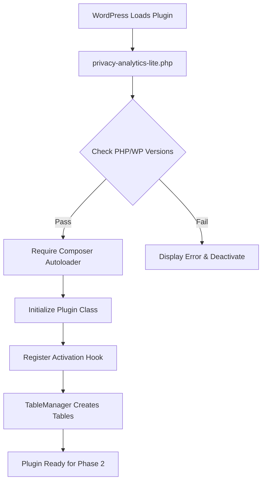

# Phase 1: Foundation - Privacy-First Analytics Lite

## Overview

Establish the core foundation of the plugin with proper WordPress plugin structure, Composer autoloading, and database schema management. This phase creates the infrastructure needed for tracking, aggregation, and dashboard functionality.

## Files to Create

### 1. `composer.json`

- Configure PSR-4 autoloading for `PrivacyAnalytics\Lite\` namespace mapping to `src/`
- Set minimum PHP version to 8.2
- Include autoload-dev for development if needed
- No external dependencies required for Phase 1

### 2. `privacy-analytics-lite.php` (Main Plugin Entry Point)

- WordPress plugin header with proper metadata (Name, Description, Version, Author, etc.)
- Plugin version constant
- Minimum PHP and WordPress version checks
- Require Composer autoloader
- Initialize main plugin class
- Register activation/deactivation/uninstall hooks
- Follow WordPress coding standards with proper escaping

### 3. `src/Core/Plugin.php`

- Main plugin orchestration class
- Singleton pattern or service container approach
- Initialize database tables on activation
- Register hooks for future phases (tracking, admin, etc.)
- Handle plugin lifecycle (activation, deactivation, uninstall)

### 4. `src/Database/TableManager.php`

- Database schema management using `dbDelta()`
- Create two tables:
- `{wp_prefix}pa_hits_temp`: Temporary raw hits storage
    - Columns: `id` (bigint, auto_increment, primary key), `visitor_hash` (varchar 64), `page_path` (varchar 255), `referrer` (varchar 255, nullable), `user_agent_hash` (varchar 64), `hit_date` (datetime), `indexes` on `hit_date` and `visitor_hash`
- `{wp_prefix}pa_daily_stats`: Aggregated statistics
    - Columns: `id` (bigint, auto_increment, primary key), `stat_date` (date), `page_path` (varchar 255), `referrer` (varchar 255, nullable), `hit_count` (int), `unique_visitors` (int), `indexes` on `stat_date` and `page_path`
- Methods: `create_tables()`, `drop_tables()`, `get_table_name()`
- Use `$wpdb->prefix` for table names
- Proper error handling and logging

### 5. Directory Structure

Create the following empty directories (or placeholder files):

- `src/Admin/` (for Phase 4)
- `src/Tracking/` (for Phase 2)
- `src/Models/` (for Phase 2)
- `assets/js/` (for Phase 4)
- `assets/css/` (for Phase 4)

## Technical Requirements

### Code Standards

- All PHP files must start with `declare(strict_types=1);`
- Use PHP 8.2+ features (readonly classes where appropriate, constructor property promotion)
- PSR-4 namespacing: `PrivacyAnalytics\Lite\Core`, `PrivacyAnalytics\Lite\Database`
- Use PHPDoc blocks for all classes and methods
- Follow WordPress Coding Standards (WPCS)

### Security

- Use `$wpdb->prepare()` for any dynamic queries (though Phase 1 primarily uses `dbDelta()`)
- Sanitize and validate all inputs
- Use WordPress nonces for any admin actions (Phase 1 has minimal admin interaction)

### Database

- Use `dbDelta()` for table creation/updates
- Store table names in constants or methods for consistency
- Handle table creation errors gracefully
- Support multisite installations (use `$wpdb->prefix`)

### WordPress Integration

- Proper plugin activation hook: `register_activation_hook()`
- Proper plugin deactivation hook: `register_deactivation_hook()`
- Consider uninstall hook for cleanup (optional in Phase 1)
- Use WordPress constants for database charset and collation

## Implementation Flow

## Testing Checklist

- [ ] Plugin activates without errors
- [ ] Composer autoloader loads classes correctly
- [ ] Database tables are created with correct schema
- [ ] Tables are created on multisite installations
- [ ] Plugin deactivation works cleanly
- [ ] No PHP 8.2 syntax errors
- [ ] No WordPress coding standards violations

## Dependencies

- PHP 8.2+
- WordPress 6.8+
- Composer (for autoloading, no external packages required)

## Notes

- The database schema is designed to support privacy-first tracking (no IP addresses, hashed visitor IDs)
- Table structure supports the aggregation strategy outlined in Phase 3
- The `pa_hits_temp` table will be truncated after aggregation (handled in Phase 3)