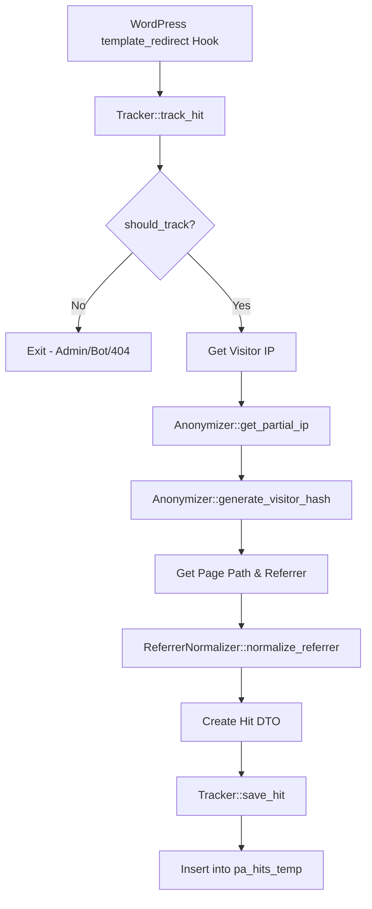

# Phase 2: Tracking Engine - Privacy-First Analytics Lite

## Overview
Implement the core server-side tracking system that captures page views while maintaining strict privacy standards. This phase creates the anonymization logic, tracking hook, and data models needed to record hits without storing any PII.

## Files to Create

### 1. `src/Models/Hit.php` (Readonly DTO)
- PHP 8.2 readonly class for hit data transfer
- Properties: `visitor_hash`, `page_path`, `referrer`, `user_agent_hash`, `hit_date`
- Immutable data structure for passing hit data between components
- Namespace: `PrivacyAnalytics\Lite\Models`

### 2. `src/Tracking/Anonymizer.php`
- Privacy hashing logic with 24-hour rotating salt
- Methods:
  - `generate_visitor_hash(string $partial_ip, string $user_agent): string` - Creates HMAC hash using daily salt
  - `get_daily_salt(): string` - Generates/retrieves salt that rotates every 24 hours (stored in transients, not options)
  - `get_partial_ip(string $ip): string` - Extracts partial IP (last octet for IPv4, last segment for IPv6) - never stored
  - `hash_user_agent(string $user_agent): string` - Hashes full user agent
- Salt rotation: Use `date('Y-m-d')` as part of salt generation, stored in transient with 24-hour expiration
- Never store full IP addresses or full user agents
- Use `hash_hmac('sha256', $partial_ip . $user_agent, $salt)` for visitor hashing

### 3. `src/Tracking/BotDetector.php`
- Detects common bot user agents
- Method: `is_bot(string $user_agent): bool`
- Check against common bot patterns (Googlebot, Bingbot, etc.)
- Use case-insensitive matching
- Return false for legitimate browsers

### 4. `src/Tracking/ReferrerNormalizer.php`
- Normalizes and groups referral sources using PHP 8.2 `match()` expressions
- Method: `normalize_referrer(string $referrer): ?string`
- Examples: 't.co' -> 'Twitter', 'facebook.com' -> 'Facebook', etc.
- Return null for direct traffic (empty referrer)
- Use `match()` for source grouping as per requirements

### 5. `src/Tracking/Tracker.php`
- Main tracking class hooked to `template_redirect`
- Methods:
  - `track_hit(): void` - Main tracking method called on hook
  - `should_track(): bool` - Checks exclusions (admins, 404s, bots)
  - `get_page_path(): string` - Extracts current page path (sanitized)
  - `get_referrer(): ?string` - Gets HTTP referrer (sanitized)
  - `save_hit(Hit $hit): void` - Inserts hit into `pa_hits_temp` table
- Exclusions:
  - Logged-in administrators (`current_user_can('manage_options')`)
  - 404 pages (`is_404()`)
  - Bot user agents (via BotDetector)
- Use `$wpdb->prepare()` for all database queries
- Extract IP from `$_SERVER['REMOTE_ADDR']` (or proxy headers if needed)
- Zero cookies - no `setcookie()` calls

### 6. Update `src/Core/Plugin.php`
- Register Tracker hook in `init()` method
- Instantiate Tracker and hook to `template_redirect`
- Ensure tracking only runs on frontend (not admin)

## Technical Requirements

### Privacy Standards
- **No PII Storage**: Never store full IP addresses or full user agents in database
- **Partial IP Only**: Extract and use only partial IP (last octet) for hashing, then discard
- **Rotating Salt**: Salt changes every 24 hours, stored in transient (auto-expires)
- **Zero Cookies**: No cookie usage whatsoever
- **Hashed Data**: All stored identifiers are hashed using HMAC-SHA256

### Security
- Sanitize all inputs: `sanitize_text_field()`, `esc_url_raw()`
- Use `$wpdb->prepare()` for database queries
- Validate IP addresses before processing
- Handle proxy headers safely (check `$_SERVER['HTTP_X_FORWARDED_FOR']` if needed)

### Performance
- Minimal overhead on `template_redirect` hook
- Fast bot detection (simple string matching)
- Efficient database inserts (single row per hit)
- No blocking operations

### Code Standards
- `declare(strict_types=1);` in all files
- PHP 8.2 features: readonly classes, constructor property promotion, `match()` expressions
- PSR-4 namespacing
- PHPDoc for all classes and methods
- WordPress Coding Standards (WPCS)

## Implementation Flow

## Data Flow

1. **Request Arrives** → `template_redirect` fires
2. **Exclusion Check** → Skip if admin, 404, or bot
3. **IP Extraction** → Get from `$_SERVER['REMOTE_ADDR']`
4. **Anonymization** → Extract partial IP, hash with daily salt
5. **Data Collection** → Page path, referrer, user agent hash
6. **Normalization** → Group referrers (Twitter, Facebook, etc.)
7. **Storage** → Insert into `pa_hits_temp` table

## Database Schema Reference

The `pa_hits_temp` table (from Phase 1):
- `visitor_hash` (varchar 64) - HMAC hash of partial IP + UA + salt
- `page_path` (varchar 255) - Sanitized page path
- `referrer` (varchar 255, nullable) - Normalized referrer or null
- `user_agent_hash` (varchar 64) - Hashed user agent
- `hit_date` (datetime) - Current timestamp

## Testing Checklist
- [ ] Tracking works on frontend pages
- [ ] Administrators are excluded
- [ ] 404 pages are excluded
- [ ] Bot user agents are excluded
- [ ] Visitor hash rotates with daily salt
- [ ] Partial IP extraction works for IPv4 and IPv6
- [ ] Referrer normalization groups sources correctly
- [ ] Data inserts correctly into `pa_hits_temp` table
- [ ] No cookies are set
- [ ] No PII is stored in database
- [ ] Performance impact is minimal

## Edge Cases to Handle
- Missing `REMOTE_ADDR` in `$_SERVER`
- Proxy headers (`HTTP_X_FORWARDED_FOR`, `HTTP_X_REAL_IP`)
- IPv6 addresses (extract last segment)
- Malformed user agents
- Very long referrer URLs (truncate to 255 chars)
- Database insert failures (log but don't break page load)

## Dependencies
- Phase 1: Database tables must exist
- WordPress 6.8+ APIs
- PHP 8.2+ features

## Notes
- The daily salt is stored in a transient with 24-hour expiration, ensuring automatic rotation
- Bot detection uses a simple whitelist/blacklist approach for performance
- Referrer normalization can be extended in future phases for more sources
- The tracking hook runs early but after WordPress is fully loaded