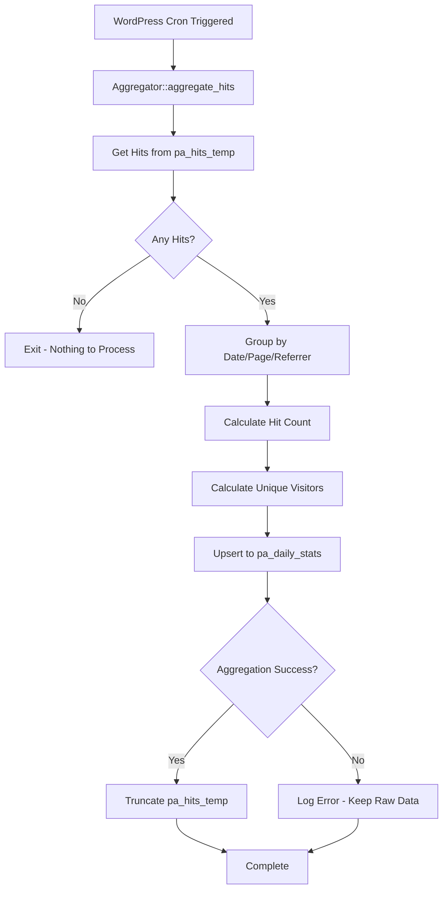

# Phase 3: Data Management - Privacy-First Analytics Lite

## Overview

Implement the data aggregation system that processes raw hits from `pa_hits_temp`, calculates aggregated statistics (hit counts and unique visitors), stores them in `pa_daily_stats`, and prunes the raw data table. This phase ensures the database remains efficient by keeping only aggregated data for dashboard queries.

## Files to Create

### 1. `src/Database/Aggregator.php`

- Main aggregation class for processing raw hits
- Methods:
- `aggregate_hits(): void` - Main aggregation method called by cron
- `get_hits_to_aggregate(): array` - Retrieves hits from `pa_hits_temp` table
- `calculate_aggregated_stats(array $hits): array` - Groups hits by date/page/referrer and calculates stats
- `save_aggregated_stats(array $stats): void` - Inserts/updates aggregated data in `pa_daily_stats`
- `prune_raw_hits(): void` - Truncates `pa_hits_temp` table after aggregation
- `get_unique_visitors_count(array $hits): int` - Counts unique visitor_hash values per group
- Aggregation logic:
- Group by: `stat_date` (date portion of hit_date), `page_path`, `referrer`
- Calculate: `hit_count` (total hits), `unique_visitors` (distinct visitor_hash count)
- Handle upserts: If stats already exist for date/page/referrer, update counts
- Use `$wpdb->prepare()` for all queries
- Handle database errors gracefully

## Files to Update

### 2. Update `src/Core/Plugin.php`

- Add `init_aggregation()` method to register cron hook
- Call `init_aggregation()` from `init()` method
- Update `activate()` to schedule cron event:
- Use `wp_schedule_event()` with hourly recurrence
- Hook name: `privacy_analytics_lite_aggregate`
- Schedule on activation if not already scheduled
- Update `deactivate()` to unschedule cron event:
- Use `wp_clear_scheduled_hook()` to remove scheduled events
- Clean up any pending aggregations

## Technical Requirements

### Aggregation Strategy

- **Frequency**: Run hourly via WordPress cron (`wp_schedule_event`)
- **Source Table**: `pa_hits_temp` (raw hits)
- **Destination Table**: `pa_daily_stats` (aggregated stats)
- **Grouping**: By date (YYYY-MM-DD), page_path, and referrer
- **Calculations**:
- `hit_count`: Total number of hits in the group
- `unique_visitors`: Count of distinct `visitor_hash` values in the group
- **Upsert Logic**: If a record exists for date/page/referrer, update the counts (add to existing)
- **Pruning**: After successful aggregation, truncate `pa_hits_temp` table

### Database Operations

- Use `$wpdb->prepare()` for all dynamic queries
- Use `INSERT ... ON DUPLICATE KEY UPDATE` or check-then-insert/update pattern
- Batch processing: Process hits in chunks if table is very large
- Transaction safety: Consider wrapping in transaction if supported
- Error handling: Log errors but don't break cron execution

### Cron Management

- **Hook Name**: `privacy_analytics_lite_aggregate`
- **Recurrence**: Hourly (`hourly` interval)
- **Schedule on Activation**: Check if already scheduled before adding
- **Unschedule on Deactivation**: Remove all scheduled instances
- **Manual Trigger**: Consider adding admin action to trigger manually (optional)

### Performance

- Efficient SQL queries with proper indexes (already created in Phase 1)
- Process in batches if needed (e.g., 1000 hits at a time)
- Use `GROUP BY` and `COUNT(DISTINCT)` for aggregation
- Minimize database queries by batching operations

### Code Standards

- `declare(strict_types=1);` in all files
- PHP 8.2 features: constructor property promotion where appropriate
- PSR-4 namespacing
- PHPDoc for all classes and methods
- WordPress Coding Standards (WPCS)
- Use WordPress time functions: `current_time('mysql')`, `date('Y-m-d')`

## Implementation Flow




## Data Aggregation Logic

1. **Retrieve Raw Hits**: Select all hits from `pa_hits_temp` table
2. **Group Data**: Group by:

- `DATE(hit_date)` as `stat_date`
- `page_path`
- `referrer` (NULL handled separately)

3. **Calculate Statistics**:

- `hit_count`: `COUNT(*)` per group
- `unique_visitors`: `COUNT(DISTINCT visitor_hash)` per group

4. **Upsert to Stats Table**: 

- If record exists (same date/page/referrer): Update counts (add new to existing)
- If record doesn't exist: Insert new record

5. **Prune Raw Data**: Truncate `pa_hits_temp` after successful aggregation

## Database Schema Reference

### `pa_hits_temp` (Source)

- `visitor_hash` (varchar 64) - Used for unique visitor counting
- `page_path` (varchar 255) - Grouping dimension
- `referrer` (varchar 255, nullable) - Grouping dimension
- `hit_date` (datetime) - Used to extract date for grouping

### `pa_daily_stats` (Destination)

- `stat_date` (date) - Aggregation date
- `page_path` (varchar 255) - Page path
- `referrer` (varchar 255, nullable) - Referrer source
- `hit_count` (int) - Total hits (incremented on upsert)
- `unique_visitors` (int) - Unique visitor count (recalculated on upsert)

## SQL Aggregation Example

```sql
SELECT 
    DATE(hit_date) as stat_date,
    page_path,
    referrer,
    COUNT(*) as hit_count,
    COUNT(DISTINCT visitor_hash) as unique_visitors
FROM {wp_prefix}pa_hits_temp
GROUP BY DATE(hit_date), page_path, referrer
```


## Testing Checklist

- [ ] Cron event is scheduled on plugin activation
- [ ] Cron event is unscheduled on plugin deactivation
- [ ] Aggregation runs hourly via WordPress cron
- [ ] Raw hits are correctly grouped by date/page/referrer
- [ ] Hit counts are calculated correctly
- [ ] Unique visitors are counted correctly (distinct visitor_hash)
- [ ] Upsert logic works (updates existing, inserts new)
- [ ] Raw hits table is truncated after successful aggregation
- [ ] Errors are logged but don't break cron execution
- [ ] Empty table handling (no errors when no hits to process)
- [ ] Large dataset handling (performance with many hits)

## Edge Cases to Handle

- No hits to aggregate (empty `pa_hits_temp` table)
- Duplicate date/page/referrer combinations (upsert correctly)
- NULL referrer values (group separately from empty strings)
- Database connection failures (log and exit gracefully)
- Partial aggregation failures (don't truncate if aggregation failed)
- Concurrent cron executions (WordPress handles this, but be aware)
- Very large hit tables (consider batch processing)

## Dependencies

- Phase 1: Database tables must exist
- Phase 2: Tracking must be writing to `pa_hits_temp`
- WordPress 6.8+ APIs
- PHP 8.2+ features

## Notes

- The aggregation runs hourly to keep the raw hits table small
- Unique visitors are calculated per aggregation group (date/page/referrer)
- The upsert pattern ensures we can handle multiple aggregation runs per day
- Truncation only happens after successful aggregation to prevent data loss
- WordPress cron is not real-time; it runs when site receives traffic