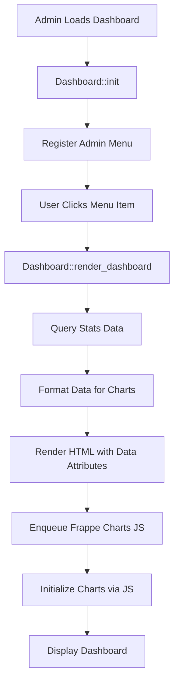

# Phase 4: Dashboard - Privacy-First Analytics Lite

## Overview

Implement the admin dashboard interface using standard PHP rendering and Frappe Charts. The dashboard displays aggregated analytics data from `pa_daily_stats` with visualizations for page views, unique visitors, top pages, and referral sources. All assets are loaded only on the plugin's admin page for optimal performance.

## Files to Create

### 1. `src/Admin/Dashboard.php`

- Main dashboard class for rendering admin interface
- Methods:
- `init()` - Register admin menu and hooks
- `add_admin_menu()` - Add menu item to WordPress admin
- `render_dashboard()` - Render dashboard page HTML
- `get_stats_data()` - Query aggregated statistics from `pa_daily_stats`
- `get_date_range_stats()` - Get stats for date range (default: last 30 days)
- `get_top_pages()` - Get top pages by hit count
- `get_referrer_stats()` - Get referral source statistics
- `get_daily_trends()` - Get daily hit and visitor trends for charts
- Security:
- Use `current_user_can('manage_options')` for capability check
- Use `check_admin_referer()` for any form actions
- Sanitize all outputs with `esc_html()`, `esc_attr()`, `number_format_i18n()`
- Data queries:
- Query only from `pa_daily_stats` table (never raw hits)
- Use `$wpdb->prepare()` for all queries
- Support date range filtering (default: last 30 days)
- Aggregate data for charts (daily trends, top pages, referrers)

### 2. `assets/css/admin-dashboard.css`

- Minimal admin styles for dashboard layout
- Styles for:
- Dashboard container and grid layout
- Stat cards (total hits, unique visitors, etc.)
- Chart containers
- Tables for top pages and referrers
- Responsive design for smaller screens
- Follow WordPress admin color scheme
- Keep styles minimal and lightweight

### 3. `assets/js/admin-dashboard.js`

- JavaScript for initializing Frappe Charts
- Functions:
- Initialize line chart for daily trends (hits over time)
- Initialize bar chart for top pages
- Initialize pie/bar chart for referral sources
- Handle date range changes (if implemented)
- Load Frappe Charts from CDN or local file
- Initialize charts after DOM is ready
- Handle empty data states gracefully

## Files to Update

### 4. Update `src/Core/Plugin.php`

- Add `init_admin()` method to register admin hooks
- Call `init_admin()` from `init()` method (only in admin context)
- Ensure admin dashboard is initialized when in admin area

## Technical Requirements

### Admin Menu Integration

- **Menu Location**: Add under "Tools" or create top-level menu item
- **Menu Slug**: `privacy-analytics-lite`
- **Page Title**: "Privacy Analytics"
- **Capability**: `manage_options` (administrators only)
- **Icon**: Use WordPress dashicon or custom SVG

### Data Display

- **Summary Stats**: Total hits, unique visitors, top pages count
- **Charts**:
- Line chart: Daily hits and visitors trend (last 30 days)
- Bar chart: Top 10 pages by hit count
- Pie/Bar chart: Referral sources breakdown
- **Tables**:
- Top pages table (page path, hits, unique visitors)
- Referrer sources table (source, hits, unique visitors)
- **Date Range**: Default to last 30 days, with option to extend

### Frappe Charts Integration

- **CDN URL**: Use Frappe Charts from CDN (e.g., `https://cdn.jsdelivr.net/npm/frappe-charts@latest/dist/frappe-charts.min.js`)
- **Chart Types**: Line, Bar, Pie charts
- **Initialization**: Initialize charts after page load
- **Data Format**: Format data from database into Frappe Charts format
- **Responsive**: Charts should be responsive and fit container

### Asset Loading

- **Conditional Loading**: Only load CSS/JS on plugin admin page
- **Enqueue Method**: Use `wp_enqueue_style()` and `wp_enqueue_script()`
- **Dependencies**: Frappe Charts as dependency for dashboard JS
- **Version**: Use plugin version for cache busting
- **Admin Only**: Hook to `admin_enqueue_scripts` with page check

### Security

- **Capability Check**: Verify `manage_options` capability
- **Nonce Verification**: Use `check_admin_referer()` for actions
- **Data Sanitization**: Sanitize all user inputs
- **Output Escaping**: Use `esc_html()`, `esc_attr()`, `esc_url()` at output
- **SQL Injection**: Use `$wpdb->prepare()` for all queries

### Code Standards

- `declare(strict_types=1);` in all PHP files
- PHP 8.2 features: constructor property promotion where appropriate
- PSR-4 namespacing
- PHPDoc for all classes and methods
- WordPress Coding Standards (WPCS)
- Use WordPress admin UI patterns and classes

## Implementation Flow




## Dashboard Layout

1. **Header Section**:

- Page title: "Privacy Analytics"
- Summary stats cards (Total Hits, Unique Visitors, Top Pages)
- Date range indicator

2. **Charts Section**:

- Daily Trends Chart (Line chart: hits and visitors over time)
- Top Pages Chart (Bar chart: top 10 pages)
- Referral Sources Chart (Pie/Bar chart: traffic sources)

3. **Tables Section**:

- Top Pages Table (sortable, paginated if needed)
- Referral Sources Table

## Data Queries

### Daily Trends Query

```sql
SELECT 
    stat_date,
    SUM(hit_count) as total_hits,
    SUM(unique_visitors) as total_visitors
FROM {wp_prefix}pa_daily_stats
WHERE stat_date >= DATE_SUB(CURDATE(), INTERVAL 30 DAY)
GROUP BY stat_date
ORDER BY stat_date ASC
```


### Top Pages Query

```sql
SELECT 
    page_path,
    SUM(hit_count) as total_hits,
    SUM(unique_visitors) as total_visitors
FROM {wp_prefix}pa_daily_stats
WHERE stat_date >= DATE_SUB(CURDATE(), INTERVAL 30 DAY)
GROUP BY page_path
ORDER BY total_hits DESC
LIMIT 10
```


### Referrer Stats Query

```sql
SELECT 
    COALESCE(referrer, 'Direct') as source,
    SUM(hit_count) as total_hits,
    SUM(unique_visitors) as total_visitors
FROM {wp_prefix}pa_daily_stats
WHERE stat_date >= DATE_SUB(CURDATE(), INTERVAL 30 DAY)
GROUP BY referrer
ORDER BY total_hits DESC
```


## Frappe Charts Data Format

### Line Chart (Daily Trends)

```javascript
{
  labels: ['2024-01-01', '2024-01-02', ...],
  datasets: [
    {
      name: 'Page Views',
      values: [100, 150, 120, ...]
    },
    {
      name: 'Unique Visitors',
      values: [80, 120, 100, ...]
    }
  ]
}
```


### Bar Chart (Top Pages)

```javascript
{
  labels: ['/page1', '/page2', ...],
  datasets: [
    {
      name: 'Hits',
      values: [500, 400, 300, ...]
    }
  ]
}
```


## Testing Checklist

- [ ] Admin menu item appears for administrators
- [ ] Dashboard page loads without errors
- [ ] Stats data queries correctly from `pa_daily_stats`
- [ ] Charts render with data
- [ ] Charts handle empty data gracefully
- [ ] CSS styles apply correctly
- [ ] JavaScript initializes charts on page load
- [ ] Frappe Charts library loads from CDN
- [ ] Assets only load on plugin admin page
- [ ] Security checks work (capability, nonce)
- [ ] All outputs are properly escaped
- [ ] Responsive design works on mobile
- [ ] Date range filtering works (if implemented)
- [ ] Tables display data correctly
- [ ] No JavaScript errors in console

## Edge Cases to Handle

- No data available (empty `pa_daily_stats` table)
- Charts with insufficient data points
- Very long page paths (truncate in display)
- Missing referrer data (show as "Direct")
- Date range with no data
- Large datasets (consider pagination)
- Browser compatibility (Frappe Charts support)

## Dependencies

- Phase 1: Database tables must exist
- Phase 3: Aggregated data must be available in `pa_daily_stats`
- WordPress 6.8+ admin APIs
- PHP 8.2+ features
- Frappe Charts library (CDN or local)

## Notes

- Frappe Charts is lightweight and doesn't require a build step
- Dashboard uses standard PHP rendering (no React/JSX)
- All data comes from aggregated table (never query raw hits)
- Keep dashboard simple and focused on key metrics
- Consider adding date range picker in future enhancement
- Charts are SVG-based and scale well